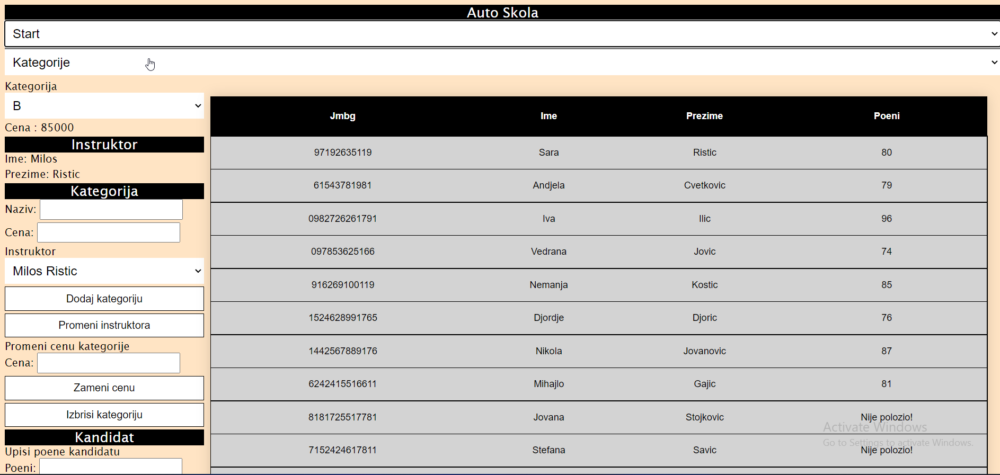
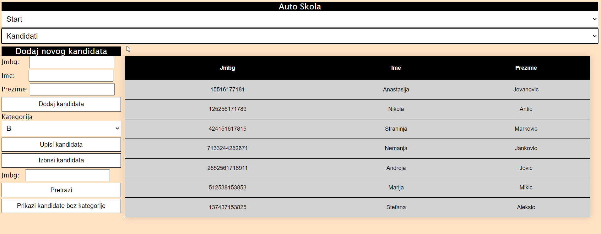
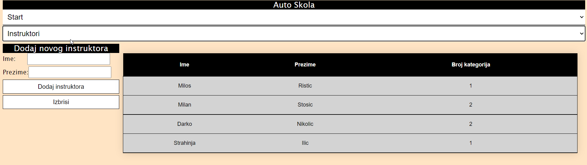

# Auto Škola - Web Application

### Project Description
This application is designed to serve as a record-keeping system for driving schools. It allows schools to manage categories, candidates, and instructors efficiently. The application provides different views and functionalities to facilitate day-to-day operations in a driving school.

### Features
#### 1. Categories
- Displays categories offered by the selected driving school.
- Options for selecting and displaying details about a category (name, price).
- Shows information about the instructor assigned to the category.
- Allows for:
  - Adding a new category.
  - Deleting a category.
  - Updating the category price.
  - Changing the instructor for a category.
  - Displaying candidates enrolled in a category.
  - Assigning points to candidates after passing the category.
- A table on the right side displays information about candidates enrolled in the selected category.

#### 2. Candidates
- Form to add a new candidate.
- Options to:
  - Enroll candidates in selected categories.
  - Search candidates by JMBG.
  - Delete candidates.
  - View candidates without any category.
- The table on the right shows candidates (by default, it shows candidates not enrolled in any category).

#### 3. Instructors
- Form to add a new instructor and an option to delete an instructor (can only delete if not assigned to any category).
- The table on the right displays instructors in the driving school (name, surname, number of categories they manage).
- Also displays instructors who are not assigned to any category.

### Project Structure
- **Controllers**: Contains the backend logic for managing categories, candidates, and instructors.
- **Frontend**: Contains HTML, CSS, and JavaScript files for the application's user interface.
- **Migrations**: Database migrations for setting up the required tables.
- **Models**: Data models representing categories, candidates, and instructors.
- **Properties**: Configuration files for database connections and other settings.
- **Screenshots**: Contains screenshots of the application, including:
  - `Instruktori.png`: Shows the instructors section.
  - `Kandidati.png`: Shows the candidates section.
  - `Kategorije.png`: Shows the categories section.
  
### Technologies Used
- **HTML5 & CSS3**: For structuring and styling the front-end interface.
- **JavaScript**: For adding interactive elements.
- **ASP.NET Core**: Backend framework for managing application logic.
- **SQL**: For storing data related to categories, candidates, and instructors.

### Screenshots
| Categories | Candidates | Instructors |
| ---------- | ---------- | ----------- |
|  |  |  |

---

This application is intended for educational purposes, demonstrating basic CRUD operations and role management within a driving school environment.
